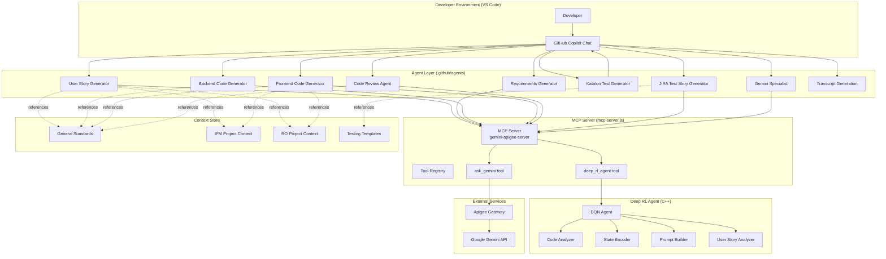
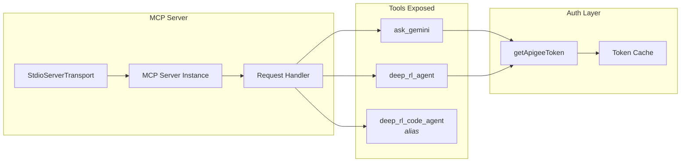
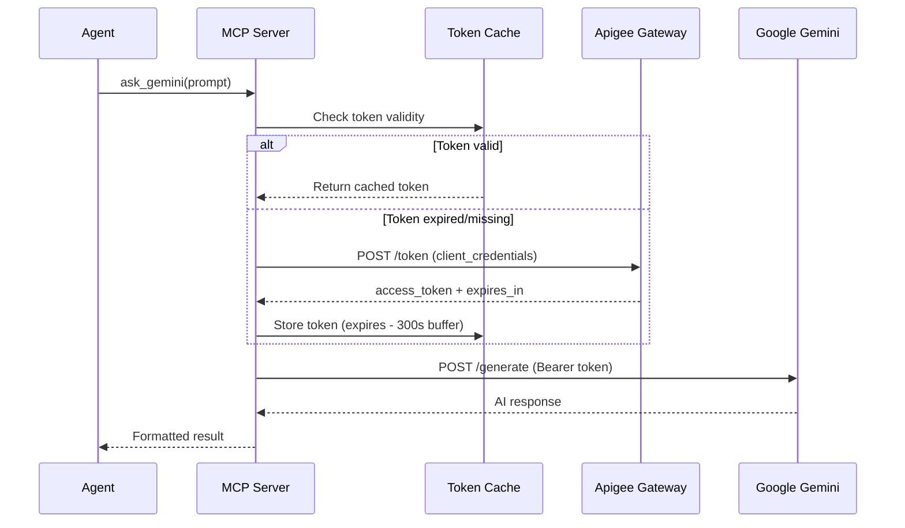
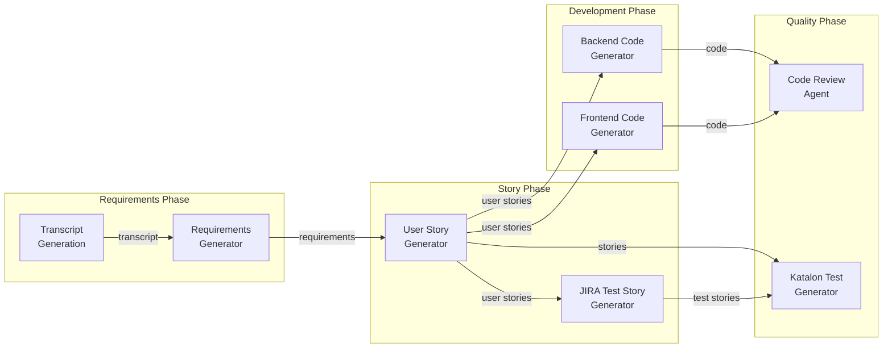
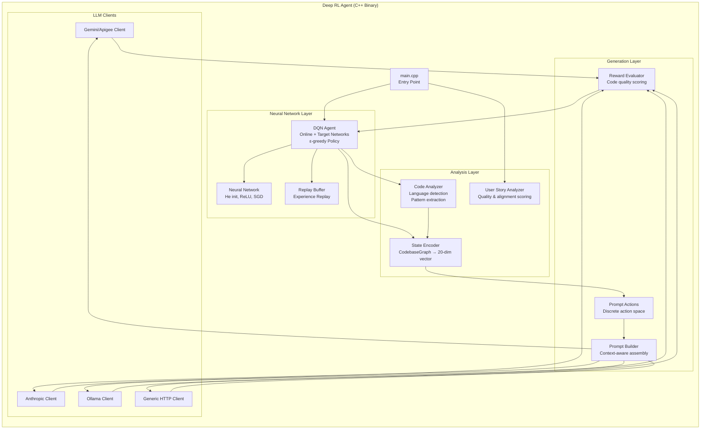
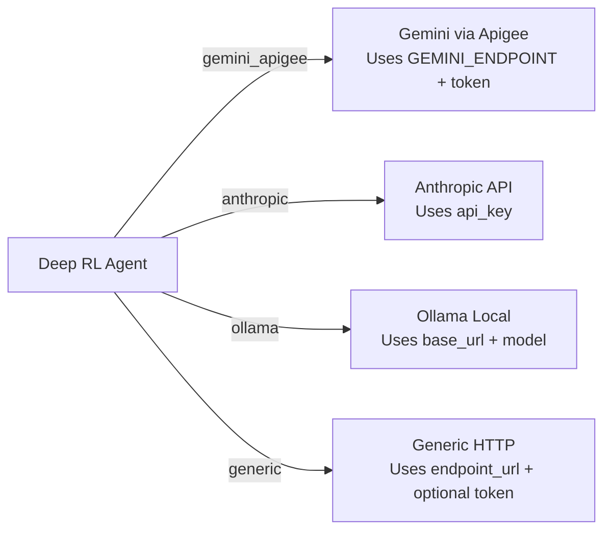
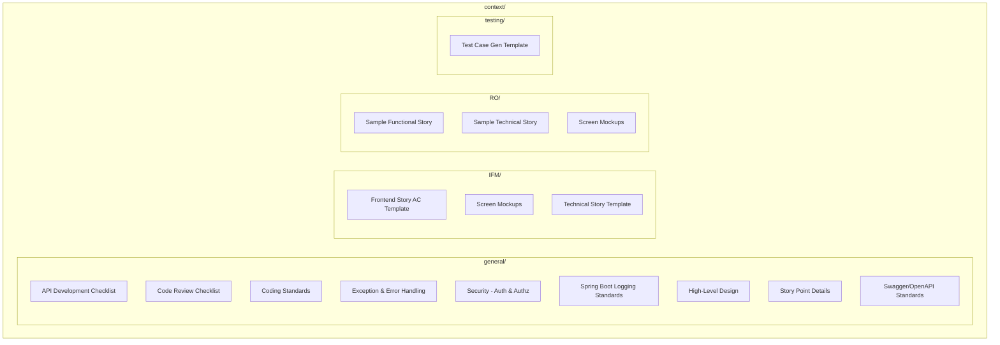
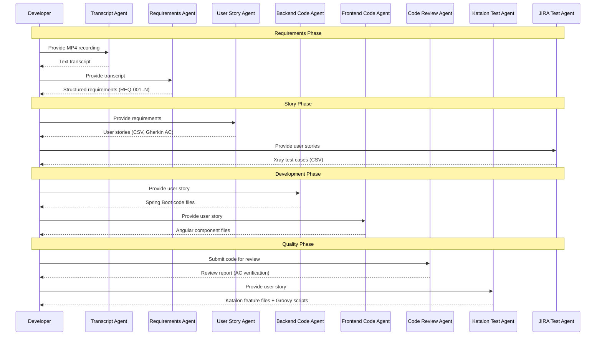
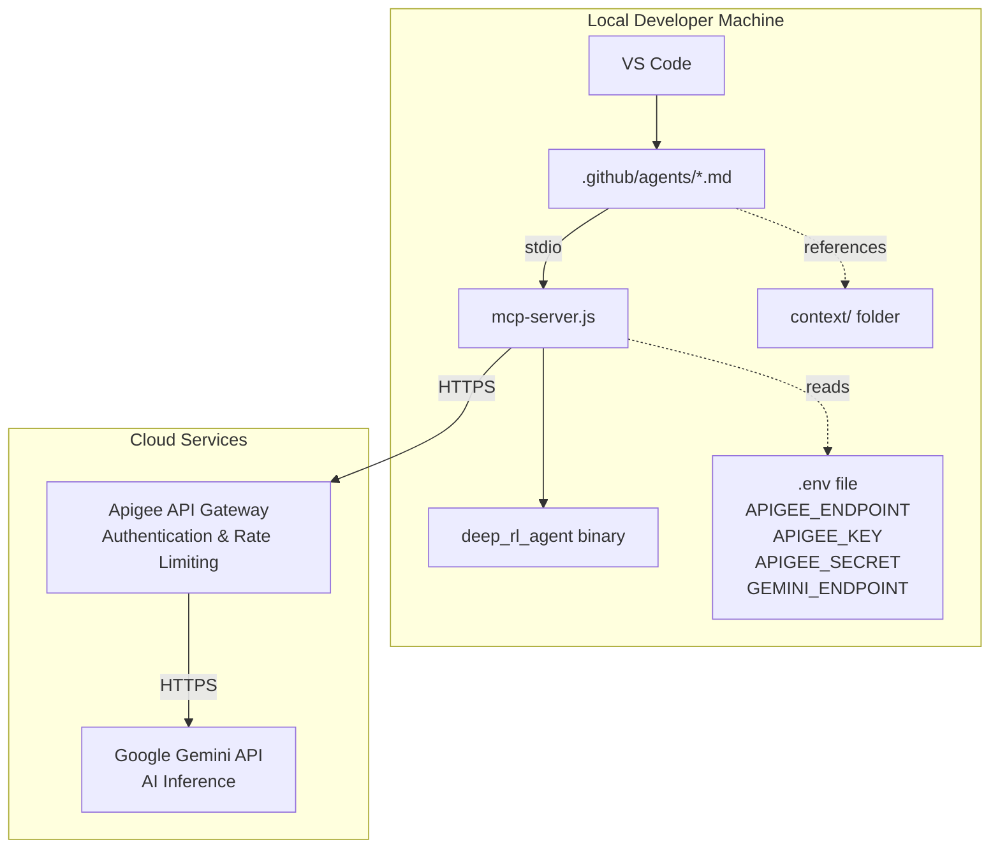

# Agents Architecture Document

## 1. Overview

This repository implements a **multi-agent AI development platform** that orchestrates specialized GitHub Copilot agents through a shared MCP (Model Context Protocol) server. The agents collaborate to support the full software development lifecycle—from requirements gathering and user story generation through code generation, code review, and test automation.

All AI-powered agents communicate with **Google Gemini** via a secure **Apigee API gateway**, with an optional **Deep Reinforcement Learning (DRL) agent** providing advanced code analysis and prompt optimization.

---

## 2. High-Level Architecture



---

## 3. Component Details

### 3.1 MCP Server (`mcp-server.js`)

The central orchestration layer implementing the **Model Context Protocol** specification. It provides a unified tool interface consumed by all agents.



| Feature | Detail |
|---------|--------|
| **Protocol** | Model Context Protocol (MCP) over stdio |
| **Runtime** | Node.js (ES Modules) |
| **Authentication** | OAuth2 client credentials via Apigee with token caching |
| **Tools** | `ask_gemini`, `deep_rl_agent`, `deep_rl_code_agent` |
| **Timeout** | 5-minute execution timeout for Deep RL analysis |

### 3.2 Authentication Flow



---

## 4. Agent Catalog

### 4.1 Agent Interaction Map



### 4.2 Agent Specifications

| Agent | File | AI Backend | Primary Tool | Purpose |
|-------|------|-----------|--------------|---------|
| **User Story Generator** | `user-story-generator.agent.md` | Gemini | `ask_gemini` | Generate INVEST-compliant user stories in CSV format |
| **Requirements Generator** | `requirements-generator.md` | Gemini | `ask_gemini` | Extract structured requirements from transcripts |
| **Backend Code Generator** | `backend-code-generator.md` | Gemini | `ask_gemini` | Generate Java Spring Boot + PostgreSQL code |
| **Frontend Code Generator** | `frontend-code-generator.md` | Gemini | `ask_gemini` | Generate Angular 15+ micro frontend code |
| **Code Review Agent** | `code-review-agent.agent.md` | Gemini | `ask_gemini` | Review code against stories & standards |
| **Katalon Test Generator** | `copilot-katalon-test-generator.agent.md` | Copilot | `ask_copilot` | Generate Gherkin feature files + Groovy test scripts |
| **JIRA Test Story Generator** | `jira-test-story-generator.md` | Gemini | `ask_gemini` | Generate Xray-compatible test cases in CSV |
| **Gemini Specialist** | `gemini-specialist.agent.md` | Gemini | `ask_gemini` | General-purpose AI assistant |
| **Transcript Generation** | `transcript-generation.md` | Whisper | Terminal exec | Transcribe MP4 files to text |

---

## 5. Deep RL Agent Architecture

The Deep Reinforcement Learning agent is a C++ binary providing intelligent code analysis and prompt optimization.



### 5.1 Operating Modes

| Mode | Trigger | Input | Output |
|------|---------|-------|--------|
| **User Story Analysis** | `analysis_type: "user_story"` | User story text + optional requirement context | Quality scores, alignment analysis |
| **Code Analysis + Generation** | `analysis_type: "code"` | Codebase path + user story + LLM provider config | Generated prompt, generated code, story analysis, code analysis |

### 5.2 Supported LLM Providers (Code Mode)



---

## 6. Context Store Structure

The `context/` directory provides domain-specific knowledge that agents reference when generating artifacts.



---

## 7. Agent Configuration Schema

Each agent is defined using a YAML frontmatter + Markdown body format:

```yaml
---
name: <agent-identifier>            # Unique agent name
description: <brief description>    # Agent purpose
tools: [<tool-list>]                # Available tool references
mcp-servers:                        # MCP server configuration
  gemini-apigee-server:
    type: 'local'
    command: 'node'
    args: ['./mcp-server.js']
    tools: ['ask_gemini']
---
# Agent Title
<markdown instructions and prompt templates>
```

### 7.1 Common Tool Categories

| Category | Tools | Used By |
|----------|-------|---------|
| **AI** | `ask_gemini`, `ask_copilot` | All agents |
| **File System** | `read_file`, `write_file`, `edit_file`, `list_files`, `delete_file` | Most agents |
| **Edit** | `edit/createDirectory`, `edit/createFile` | Most agents |
| **Agent** | `agent/runSubagent` | Code Review, Frontend, JIRA Test |
| **Web** | `web/search`, `web/scrape` | Code Review, Frontend, JIRA Test |
| **Execution** | `execute`, `read`, `edit`, `search`, `todo` | Backend, Gemini Specialist |

---

## 8. Data Flow — End-to-End SDLC



---

## 9. Technology Stack

| Layer | Technology | Version |
|-------|-----------|---------|
| **IDE** | VS Code + GitHub Copilot | Latest |
| **Agent Runtime** | GitHub Copilot Agents | — |
| **MCP Server** | Node.js (ES Modules) | 18+ |
| **MCP Protocol** | `@modelcontextprotocol/sdk` | 1.x |
| **AI Gateway** | Google Apigee | — |
| **AI Model** | Google Gemini | — |
| **Deep RL** | Custom C++ (DQN) | C++17 |
| **Transcription** | OpenAI Whisper | medium model |
| **Target Backend** | Java Spring Boot + PostgreSQL | v21 / latest |
| **Target Frontend** | Angular (Micro Frontends) | 15+ |
| **Test Automation** | Katalon (Gherkin/Groovy) | — |
| **Project Management** | JIRA + Xray | — |

---

## 10. Deployment Architecture



### 10.1 Environment Variables

| Variable | Purpose |
|----------|---------|
| `APIGEE_ENDPOINT` | OAuth2 token endpoint for Apigee |
| `APIGEE_KEY` | API key for client credentials grant |
| `APIGEE_SECRET` | API secret for client credentials grant |
| `GEMINI_ENDPOINT` | Gemini model inference endpoint |

---

## 11. Security Considerations

- **No hardcoded secrets** — All credentials loaded from `.env` file
- **Token caching with buffer** — Tokens refreshed 300 seconds before expiry
- **Apigee Gateway** — Provides rate limiting, monitoring, and access control
- **Client Credentials flow** — Machine-to-machine auth, no user tokens exposed
- **Process isolation** — Deep RL agent runs as a sandboxed subprocess with 5-minute timeout
- **Input validation** — MCP server validates all tool parameters before execution

---

## 12. Extension Points

| Extension | How |
|-----------|-----|
| **Add new agent** | Create `.md` file in `.github/agents/` with YAML frontmatter |
| **Add new MCP tool** | Register in `ListToolsRequestSchema` handler in `mcp-server.js` |
| **Add LLM provider** | Implement provider case in `buildDeepRLArgs()` function |
| **Add project context** | Create subfolder in `context/` with standards and templates |
| **Switch AI model** | Update `GEMINI_ENDPOINT` environment variable |

---

## 13. Key Design Decisions

1. **MCP over stdio** — Enables local, low-latency agent-tool communication without network overhead
2. **Gemini via Apigee** — Enterprise security, audit logging, and rate control over direct API access
3. **Separate agents per concern** — Single-responsibility agents that can be composed for complex workflows
4. **Context-driven generation** — All agents reference shared standards and templates for consistency
5. **Deep RL for prompt optimization** — Learned prompt construction outperforms static templates for code generation
6. **CSV output format for stories** — Direct JIRA/Xray bulk import compatibility
7. **Gherkin acceptance criteria** — Machine-readable test specifications that bridge stories and automation
